```mermaid
gantt
    title Ciclo Logístico del Servicio Metrológico (30 Días)
    dateFormat  X
    axisFormat %d días
    
    section Cotización y Trámite
    Búsqueda y Contacto con Proveedor Acreditado     :active, 0, 5
    Elaboración y Aprobación de la Cotización         : 5, 12
    
    section Programación
    Coordinación de Tiempos y Espacios en Planta     : 12, 17
    
    section Ejecución
    Ejecución del Servicio (Calibración/Validación)  : 17, 24
    
    section Cierre
    Emisión y Entrega de Certificados/Equipo         : 24, 30
```

# Informe de Avance Parcial: Digitalización y Optimización del Módulo Metrológico (PAME)

**Proyecto de Grado para la Titulación Profesional**  
**Autor:** Juliana Gómez  
**Fecha de Generación:** 30 de Julio de 2026  
**Destinatario:** Asesor Interno del Proyecto de Grado / Profesor de Universidad  

---

## 1. Resumen Ejecutivo

El presente informe de avance parcial expone de manera detallada el diseño, la reestructuración y el estado técnico del módulo digital de **Plan de Aseguramiento Metrológico (PAME)** concebido para **Laboratorios Laproff S.A.S.** En el transcurso de las últimas semanas, se abordó la necesidad de migrar un cronograma tradicional en hojas de cálculo hacia una plataforma web centralizada, interactiva y de alto rendimiento.

A través de una reingeniería de bases de datos, se resolvió un cuello de botella de rendimiento que congelaba el software durante varios minutos ante cargas de datos masivas. Asimismo, se integró el motor de notificaciones automáticas por correo electrónico a través de la API SMTP de Brevo. Este informe describe detalladamente el **CÓMO** y el **PORQUÉ** de las decisiones arquitectónicas tomadas, sirviendo de base para la retroalimentación del asesor antes de proceder a la redacción formal de la tesis y las validaciones en sitio.

---

## 2. Arquitectura del Sistema: ¿Cómo y Con Qué se Construyó?

Para garantizar un desarrollo ágil, seguro y mantenible, se seleccionó un stack tecnológico robusto, orientado a la representación de datos analíticos en tiempo real:

*   **Interfaz de Usuario (Frontend):** Desarrollada en **Streamlit (Python)** acoplado a un sistema de diseño web premium mediante CSS nativo. Esto proporciona una navegación fluida basada en pestañas (Dashboard, Inventario, Cumplimiento, Cronograma y Migración ETL) y un diseño responsivo adaptado a estaciones de cómputo en planta.
*   **Base de Datos (Persistencia):** Implementada sobre **Firebase / Google Cloud Firestore** en modo NoSQL y adaptada con repositorios locales parametrizables (Modo Demo) para garantizar portabilidad e independencia de infraestructura durante el desarrollo preliminar.
*   **Motor de Alertas y Notificaciones (Integración Externa):** Conectado a través del protocolo SMTP cifrado con **Brevo (Sendinblue)**. El sistema despacha correos automáticos estructurados en HTML responsivo que contienen tablas analíticas e indicadores clave de rendimiento (KPIs) en tiempo real.

---

## 3. Comparativo de Estado: Objetivos Iniciales vs. Avances Logrados

A continuación, se detalla el progreso técnico y funcional comparando el punto de partida con los hitos alcanzados recientemente:

| Área del Proyecto | Estado Inicial | Avance Implementado y Funcional |
| :--- | :--- | :--- |
| **Rendimiento e Integridad** | El cambio entre pestañas del aplicativo tardaba hasta **3 minutos** tras cargar bases de datos reales más pesadas (debido a consultas recursivas N+1 en la base de datos). | **Optimización del 1000% ($O(N)$ lineal):** Rediseño del motor de consultas de base de datos para agrupar servicios en memoria y almacenamiento en caché inteligente. La transición entre pestañas ahora es **instantánea** (milisegundos) y soporta bases de datos de gran volumen. |
| **Notificaciones por Correo** | Fallas de remitente inválido y desconexión con el servidor SMTP de Brevo. No se recibían alertas. | **Sincronización Exitosa:** Configuración del canal de retransmisión SMTP cifrado con Brevo. Despacho probado y funcional hacia el correo objetivo (`juli3213@gmail.com`). |
| **Automatización de Alertas** | Inexistente. Solo existía la opción de consulta visual o descarga del cronograma en Excel. | **Lógica de Alertas Automáticas:** Creación de un servicio en segundo plano que evalúa el inventario a diario y envía un correo consolidado de alertas cuando se acumula un lote de $\ge 5$ equipos próximos a vencer. Si un equipo es crítico (<15 días restantes), el sistema evade la regla del lote y envía una alerta inmediata. |
| **Reportes y Cuadro de Mando** | Visualizaciones estándar sin KPIs consolidados. | **Dashboard de KPIs Enriquecido:** Implementación de un *Índice de Salud Metrológica* ejecutivo, tasas de conformidad del cronograma y un reporte diario automático de KPIs enviado por correo con barra de distribución gráfica nativa HTML/CSS. |

---

## 4. Decisiones Técnicas Clave y Justificaciones (El "Por Qué")

### A. Eliminación del congelamiento del sistema (Optimización del Backend)
*   **Desafío Detectado:** Al cargar la base de datos completa de Laboratorios Laproff, que incluye cientos de registros de equipos y múltiples servicios históricos de calibración/validación, la aplicación sufría un congelamiento de hasta 3 minutos al cambiar de pestaña. El análisis del log arrojó un error de diseño de tipo **N+1**: el sistema realizaba consultas consecutivas a la base de datos por cada celda y equipo renderizado en pantalla.
*   **Solución Implementada:** Se reescribió el repositorio de datos para descargar la totalidad de los servicios en una sola consulta agrupada, resolviendo la relación en memoria con complejidad de tiempo $O(N)$ lineal. Adicionalmente, se decoraron las funciones de lectura con almacenamiento en caché local (`@st.cache_data`) y se configuró un mecanismo automático de invalidación que borra la caché solo cuando se ejecuta una nueva migración de datos, asegurando que la información permanezca al día sin saturar el servidor. El paso entre pestañas pasó a ser instantáneo.

### B. Reglas de Envío de Alertas por Lotes para Evitar Fatiga por Notificaciones
*   **Desafío Detectado:** Enviar correos electrónicos diarios por cada equipo próximo a vencer genera saturación (*fatiga por alertas*) en la bandeja de entrada del coordinador de metrología, lo que usualmente conduce a que las notificaciones sean ignoradas.
*   **Solución Implementada:** Se programó una regla de negocio inteligente. Las alertas estándar (equipos en estado 'Programar' con 15 a 45 días restantes) se retienen y solo se despachan automáticamente una vez acumuladas en un lote consolidado de cinco (5) o más equipos. No obstante, si el sistema detecta algún equipo en estado 'Crítico' (menos de 15 días para vencer), la regla del lote se evade automáticamente y se despacha una alerta roja de forma inmediata.

---

## 5. Justificación Metrológica del Plazo de Alerta de 1 Mes (30 días)

Uno de los puntos clave a defender ante el jurado y el asesor universitario es la selección del plazo preventivo de **30 días** para las alertas automáticas. En metrología industrial y manufactura farmacéutica, el vencimiento de un instrumento implica su retiro inmediato del proceso productivo, lo que puede detener líneas enteras de envasado, dosificación o control de calidad. Por ende, 30 días es el margen óptimo debido al siguiente ciclo logístico real:

1.  **Trámite Administrativo y Cotización (Días 1 a 12):** El coordinador debe documentar las especificaciones y tolerancias del instrumento, solicitar cotizaciones a proveedores externos que cuenten con acreditación ONAC (u homólogos vigentes) y tramitar la aprobación del gasto con el departamento de compras.
2.  **Programación Operativa (Días 12 a 17):** Se negocia con el área de producción del laboratorio para hallar ventanas de tiempo en las que el equipo pueda calibrarse en sitio o enviarse al laboratorio del proveedor, minimizando el impacto en la cadena de manufactura de medicamentos.
3.  **Ejecución Técnica del Servicio (Días 17 a 24):** Corresponde al traslado físico del patrón o del instrumento, ejecución del ensayo metrológico, cálculo de incertidumbres y el tiempo de emisión del informe técnico por parte del laboratorio externo.
4.  **Entrega y Dictamen de Conformidad (Días 24 a 30):** El coordinador recibe el equipo y el certificado de calibración. Se realiza un análisis de tolerancia del proceso para verificar si la desviación del instrumento cumple con los requisitos del método analítico. Si cumple, se etiqueta como 'Conforme' y se reincorpora oficialmente a planta antes de la fecha límite.

**Conclusión:** Un tiempo de alerta inferior a 30 días pondría en riesgo la continuidad operativa de los análisis en Laboratorios Laproff, forzando al uso de equipos vencidos o a detenciones de producción no planificadas.

---

## 6. Resumen de Pruebas y Validación Técnica

El módulo cuenta con una suite de pruebas de caja blanca utilizando `pytest` en la carpeta `tests/`. Estas pruebas automatizadas simulan cargas masivas a la base de datos, el cálculo matemático de días restantes, las reglas lógicas de transición de estados del cronograma y el formateo dinámico de correos en HTML. Todas las pruebas integradas pasan con éxito (**13 pruebas aprobadas** de forma limpia), lo que garantiza la estabilidad estructural de la aplicación ante cambios futuros.

---

## 7. Roadmap y Puntos Clave para la Reunión con el Asesor

A continuación se enlistan las áreas de mejora visual y técnica en las que se continuará trabajando y que servirán de base para la retroalimentación inmediata del profesor:

*   **Mejoras de Frontend y Visualización de Gráficos:** Ajustar las leyendas y títulos de los ejes X e Y de las gráficas de Plotly. En pantallas angostas, algunos nombres extensos de áreas del laboratorio tienden a recortarse.
*   **Retroalimentación sobre Pruebas de Campo:** Definir el protocolo de validación y el tiempo óptimo del piloto con datos reales del laboratorio. ¿Es recomendable mantener el paralelo con el sistema anterior por 1 o 2 semanas?
*   **Definición de Capítulos de Tesis:** Presentar la estructura inicial del documento escrito de grado para recibir sus sugerencias en cuanto a los apartados teóricos de aseguramiento metrológico e ingeniería de software.
