# Informe de Avance Parcial: Digitalización y Optimización del Módulo Metrológico (PAME)

**Proyecto de Grado**  
**Autor:** Juliana Gómez  
**Fecha:** 29 de Julio de 2026  
**Destinatario:** Asesor Interno del Proyecto de Grado / Profesor de Universidad  

---

## 1. Resumen Ejecutivo

Este informe presenta el estado de avance actual del desarrollo e implementación del módulo de **Aseguramiento Metrológico Digital (PAME)** para Laboratorios Laproff S.A.S. Durante las últimas semanas, el proyecto ha transitado de una fase preliminar con cuellos de botella técnicos a un prototipo completamente funcional, optimizado para grandes bases de datos e integrado con sistemas de despacho automático de notificaciones. 

Este documento sirve como insumo de cara a la revisión parcial previa a la redacción definitiva del documento de tesis y a la validación final del sistema.

---

## 2. Comparativo de Estado: Objetivos Iniciales vs. Avances Logrados

A continuación, se detalla el progreso técnico y funcional comparando el punto de partida con los hitos alcanzados recientemente:

| Área del Proyecto | Estado Inicial | Avance Implementado y Funcional |
| :--- | :--- | :--- |
| **Rendimiento e Integridad** | El cambio entre pestañas del aplicativo tardaba hasta **3 minutos** tras cargar bases de datos reales más pesadas (debido a consultas recursivas N+1 en la base de datos). | **Optimización del 1000% ($O(N)$ lineal):** Rediseño del motor de consultas de base de datos para agrupar servicios en memoria y almacenamiento en caché inteligente. La transición entre pestañas ahora es **instantánea** (milisegundos) y soporta bases de datos de gran volumen. |
| **Notificaciones por Correo** | Fallas de remitente inválido y desconexión con el servidor SMTP de Brevo. No se recibían alertas. | **Sincronización Exitosa:** Configuración del canal de retransmisión SMTP cifrado con Brevo. Despacho probado y funcional hacia el correo objetivo (`juli3213@gmail.com`). |
| **Automatización de Alertas** | Inexistente. Solo existía la opción de consulta visual o descarga del cronograma en Excel. | **Lógica de Alertas Automáticas:** Creación de un servicio en segundo plano que evalúa el inventario a diario y envía un correo consolidado de alertas cuando se acumula un lote de $\ge 5$ equipos próximos a vencer. Si un equipo es crítico (<15 días restantes), el sistema evade la regla del lote y envía una alerta inmediata. |
| **Reportes y Cuadro de Mando** | Visualizaciones estándar sin KPIs consolidados. | **Dashboard de KPIs Enriquecido:** Implementación de un *Índice de Salud Metrológica* ejecutivo, tasas de conformidad del cronograma y un reporte diario automático de KPIs enviado por correo con barra de distribución gráfica nativa HTML/CSS. |

---

## 3. Justificación de Decisiones Metrológicas

### Regla de Anticipación de 1 Mes (30 días) para Alertas Automáticas

Una de las decisiones clave de diseño y validación del sistema fue establecer que **las alertas preventivas automáticas de calibración y validación se despachen exactamente con 1 mes de anticipación**. Esta decisión no es arbitraria; obedece a la realidad logística y operativa del aseguramiento metrológico en la industria farmacéutica y de laboratorios:

```mermaid
gantt
    title Ciclo Logístico del Servicio Metrológico (30 Días)
    dateFormat  X
    axisFormat %d días
    
    section Cotización y Trámite
    Búsqueda y Contacto con Proveedor Acreditado     :active, 0, 5
    Elaboración y Aprobación de la Cotización         : 5, 12
    
    section Programación
    Coordinación de Tiempos y Espacios en Planta     : 12, 17
    
    section Ejecución
    Ejecución del Servicio (Calibración/Validación)  : 17, 24
    
    section Cierre
    Emisión y Entrega de Certificados/Equipo         : 24, 30
```

1. **Cotización y Selección de Proveedores (Días 1 a 12):** No todas las magnitudes son calibradas internamente. El coordinador de metrología debe buscar proveedores con acreditación ONAC (u homólogos), enviar alcances, esperar propuestas económicas, tramitar aprobaciones de compras internas y emitir la orden de servicio.
2. **Coordinación de Tiempos y Espacios (Días 12 a 17):** Se programan las fechas de la visita del técnico o el envío de los patrones, asegurando que no interfiera críticamente con los lotes de producción activos del laboratorio.
3. **Ejecución del Servicio y Emisión de Informes (Días 17 a 24):** El periodo en el que se ejecuta físicamente la calibración y el tiempo de tolerancia que requiere el laboratorio externo para generar y firmar los certificados metrológicos.
4. **Entrega y Restablecimiento (Días 24 a 30):** El equipo regresa a la planta, se verifica la conformidad del certificado contra las tolerancias del proceso, se etiqueta y se pone en funcionamiento nuevamente.

**Conclusión:** Un tiempo de alerta inferior a 30 días pondría en riesgo la continuidad operativa de los análisis en Laboratorios Laproff, forzando al uso de equipos vencidos o a detenciones de producción no planificadas.

---

## 4. Estado de la Validación Técnica

Las pruebas y el control de calidad del código han arrojado resultados muy positivos:
* **Pruebas Unitarias Integradas:** Se cuenta con una suite de pruebas automatizadas en `tests/` que validan el motor de priorización de alertas, el agrupamiento por áreas, el pipeline de ETL de datos pesados y la simulación del envío de correos.
* **Resultados:** 100% de las pruebas ejecutadas (`13 passed`) pasan exitosamente de manera limpia y sin errores de sintaxis o de compilación.

---

## 5. Trabajo Pendiente (Roadmap del Proyecto)

De cara al cierre del proyecto de grado y tras la retroalimentación del asesor en la próxima reunión, se tienen mapeadas las siguientes actividades pendientes:

### A. Mejoras en el Frontend (Detalles Visuales)
- **Títulos y Ejes de Gráficos:** Uniformar las etiquetas del eje Y (conteo de equipos) y el eje X (áreas del laboratorio/meses) en las gráficas de Plotly de la pestaña principal del Dashboard.
- **Leyendas Dinámicas:** Mejorar la visibilidad de los nombres largos de equipos y áreas para evitar que se superpongan en resoluciones más pequeñas.
- **Historial de Envíos:** Dar formato de tabla más elegante al historial de alertas enviadas que se muestra en el panel.

### B. Fase Final de Validación
- **Pruebas de Campo:** Ejecutar un piloto en paralelo de 1 a 2 semanas utilizando datos reales del día a día del laboratorio para asegurar que el despachador automático no genere falsos positivos o spam de alertas.
- **Validación del Usuario:** Confirmar que los correos automáticos diarios de KPIs cumplan las expectativas visuales del coordinador metrológico y la dirección técnica.

### C. Redacción del Documento Escrito (Tesis)
- Redacción formal de los capítulos de Metodología de Implementación y Resultados.
- Documentar el análisis de eficiencia antes y después de la optimización del backend.

---

## 6. Siguientes Pasos de Cara a la Reunión con el Asesor

Este informe servirá de base para la próxima sesión de revisión con el asesor universitario. El objetivo de la reunión será:
1. Validar el enfoque funcional del sistema PAME.
2. Confirmar si la justificación logística para la alerta preventiva de 30 días es considerada suficiente para el marco teórico de la tesis.
3. Obtener aprobación del profesor para dar inicio a la redacción definitiva del documento escrito.
